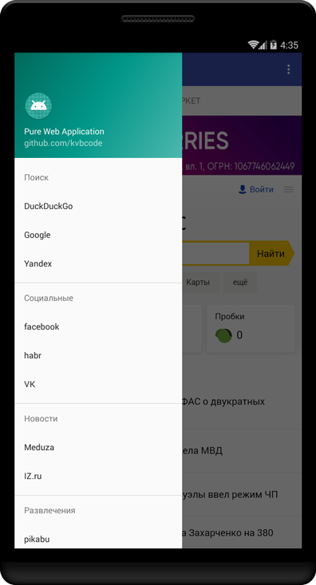
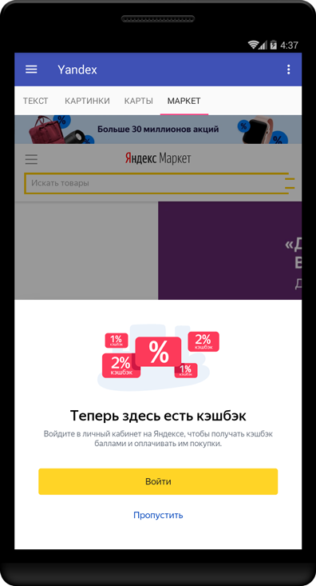

# pwa-template
Pure Web Application template for Android written on Kotlin. Application downloads menu_data.json directly from site and build navigation menu and tabs.

# example menu_data.json
```json
{ "default_uri":"https://google.com",
  "groups":[
    {"group_title":"Поиск",
      "items": [
        {"item_title":"DuckDuckGo", "uri":"https://duckduckgo.com"},
        {"item_title":"Google", "tabs":[
          {"tab_title":"Текст", "uri":"https://google.com"},
          {"tab_title":"Картинки", "uri":"https://images.google.com"},
          {"tab_title":"Youtube", "uri":"https://youtube.com"}
        ]},
        {"item_title":"Yandex", "tabs":[
          {"tab_title":"Текст", "uri":"https://m.yandex.ru"},
          {"tab_title":"Картинки", "uri":"https://yandex.ru/images"},
          {"tab_title":"Карты", "uri":"https://yandex.ru/maps"},
          {"tab_title":"Маркет", "uri":"https://market.yandex.ru"}
        ]}
      ]
    },
    {
      "group_title": "Социальные",
      "items": [
        {"item_title":"facebook", "uri":"https://facebook.com"},
        {"item_title":"habr", "uri":"https://m.habr.com"},
        {"item_title":"VK", "uri":"https://m.vk.com"}
      ]
    },
    {
    	"group_title": "Новости",
    	"items": [
        {"item_title":"Meduza", "uri":"https://meduza.io"},
        {"item_title":"IZ.ru", "uri":"https://iz.ru"}
    	]
    },
    {"group_title":"Развлечения",
      "items": [
        {"item_title":"pikabu", "uri":"https://m.pikabu.ru"},
        {"item_title":"reactor", "uri":"http://m.joyreactor.cc"},
        {"item_title":"bash", "tabs":[
          {"tab_title":"bash.im", "uri":"https://bash.im"},
          {"tab_title":"ithappens.me", "uri":"https://ithappens.me"},
          {"tab_title":"zadolba.li", "uri":"https://zadolba.li"}
        ]}
      ]
    }
  ]
}
```


